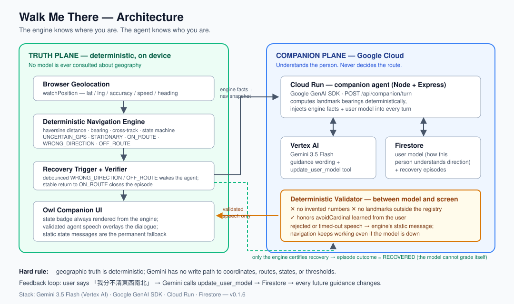
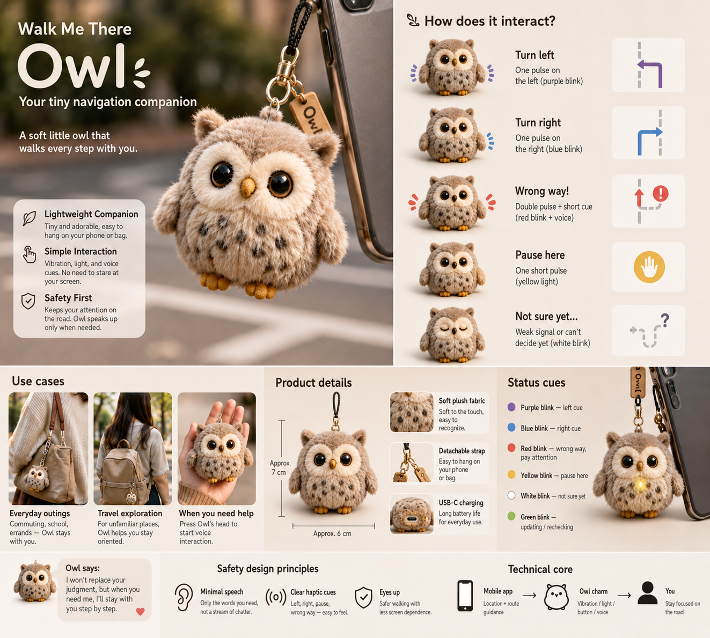

# Walk Me There

> **Maps know the route. Walk Me There helps the human actually follow it.**

Walk Me There is a mobile walking companion for people who can know the address, have directions in front of them, and still wonder:

- Which way am I actually facing?
- Which left turn do you mean?
- Is this the intersection?
- Have I been walking the wrong way for the last 30 seconds?

Instead of dumping a route and expecting the human to interpret it, Walk Me There is built around a tighter loop:

**Observe → Decide → Guide → Verify → Recover**

The companion is a small owl with one product rule:

> **牠知道路，但不嫌你不知道。**  
> It knows the way without making you feel bad for not knowing it.

## Live demo

**https://walk-me-there-v01-134673885671.asia-east1.run.app**

Best experienced on a phone with location permission enabled.

## What exists today

The current build has two roles with a hard boundary between them:

**The navigation engine tells the truth.** Deterministic geometry (distance, bearing,
cross-track) decides where you are, whether you turned around, and whether you are
off the route. Five states: `UNCERTAIN_GPS`, `STATIONARY`, `ON_ROUTE`,
`WRONG_DIRECTION`, `OFF_ROUTE`. No model is ever consulted about geography.

**Gemini translates the truth into words this specific person understands — and
remembers how.** When the engine confirms you are lost, a companion agent
(Gemini 3.5 Flash on Vertex AI, via the Google GenAI SDK) receives the engine's
facts and this user's profile, and phrases the way back. When you tell the owl
「我分不清東西南北」, the agent calls its `update_user_model` tool, the fact is
persisted to Firestore, and **every future guidance stops using cardinal
directions** — enforced by a deterministic validator, not by prompt hope.

Components:

- React + TypeScript + Vite mobile UI, browser `watchPosition`
- Deterministic navigation engine (unchanged since `v0.1.5`)
- Companion agent service: Node + Express on Cloud Run
  - Gemini 3.5 Flash via Vertex AI (`@google/genai`)
  - Function calling: the model decides what to remember about the user
  - Firestore: persistent user model + recovery episodes
  - Deterministic validator between the model and the screen
    (no invented numbers, no unregistered landmarks, honors `avoidCardinal`)
- Recovery episodes are opened by the engine, and **closed only by the engine**
  when it verifies the user is stably back on route — the model cannot certify
  its own success. The server also **recomputes the navigation state from raw
  observations** before waking the agent; a client-claimed state is never trusted
- Deterministic test suite covering geometry, the state machine (frontend and
  server), and the validator
- Simulated-walk harness (`?sim=1`) that replays a scripted GPS trace of the
  test route — walk, turn around, recover, deviate, recover — for verification
  and demos without standing next to Taipei 101

The current test route is a hardcoded ~200 m polyline around the Taipei 101 area. It exists only to calibrate the navigation engine before real route APIs are introduced.

## Architecture



```text
Browser Geolocation ──► Deterministic engine ──► NavState + telemetry ──► Owl UI
                        (distance / bearing /          │      ▲
                         cross-track / verify)         ▼      │ validated speech
                                              Companion agent (Cloud Run)
                                              Gemini 3.5 Flash · Vertex AI
                                                 │ update_user_model tool
                                                 ▼
                                              Firestore (user model + episodes)
```

The important architectural rule is:

> **Geographic truth must be deterministic. Language is presentation.**
>
> The engine knows where you are. The agent knows who you are.

The LLM never invents a route, never decides whether the user is off-route,
and never outputs a number. A deterministic validator rejects any guidance that
breaks these rules — including references to places outside the curated
registry (proper-noun and POI/transit-name heuristics) — and the UI falls back
to the engine's static state messages: navigation keeps working even if the
model is down.

## Current technical caveat

`WRONG_DIRECTION` currently relies on the browser/device `GeolocationCoordinates.heading` value when it is available.

That is intentionally not being treated as solved. The next field tests are designed to answer whether real phones provide a stable enough heading signal during walking and turn-around behavior. If not, the next engine change will derive movement bearing from sequential GPS samples with minimum-displacement and rolling-window stabilization while preserving the same state contract.

## Field-test status

The app has completed an initial outdoor phone smoke test: it loads, receives location, and is usable outside.

The core navigation thesis is **not yet validated**. The next tests are:

1. **T1 — Stationary:** stand still → expect `STATIONARY`
2. **T2 — Correct direction:** walk along the route → expect stable `ON_ROUTE`
3. **T3 — Turn around:** walk correctly, then reverse direction → expect `WRONG_DIRECTION`
4. **T4 — Deviate:** move clearly away from the route → expect `OFF_ROUTE`

The most important gate is T3:

> **Can the system detect that a real person has turned around, within a useful number of seconds, without the person first pressing “I’m lost”?**

## What is deliberately not built yet

No Google Routes, Places, TTS, Vision, account system, destination search, or travel-planning layer is integrated yet.

That is intentional. The project built the physical navigation loop first, then added exactly one agentic capability: **remembering how a specific person understands direction, and changing future guidance because of it.**

## The next body



The screen is not the owl's final body. The destination is a soft, palm-sized
owl that hangs on your phone or bag and speaks in vibration and light —
one pulse left, one pulse right, a double pulse and a red blink when you've
turned the wrong way. Eyes up, no screen, no map-reading skill required.

This is why the navigation truth layer was deliberately kept small and
deterministic: **it is small enough to live inside a plush owl with one motor
and one LED.** The five navigation states map one-to-one onto haptic and light
cues; Gemini's voice joins only when you press the owl's head to talk. The
architecture doesn't change — the body does.

> **Owl says:** I won't replace your judgment, but when you need me,
> I'll stay with you step by step.

## Planned progression

```text
Field calibration
    ↓
Robust movement-bearing estimation (if required)
    ↓
Google Routes — route truth
    ↓
Google Places — landmark context (expands the curated registry)
    ↓
TTS — the owl's voice
    ↓
Owl charm hardware (BLE: vibration + light cues, press-head-to-talk)
    ↓
Optional Vision
```

## Run locally

```bash
npm install
npm test
npm run dev
```

Production build:

```bash
npm run build
```

Companion agent server (requires Google Cloud ADC with Vertex AI + Firestore access):

```bash
cd server && npm install
GOOGLE_CLOUD_PROJECT=walk-me-there node index.js
# serves the built frontend from ../dist and the agent API on :8080
```

Simulated walk (no GPS needed): open the app with `?sim=1`.

## Baseline

The pre-field-test source baseline is tagged:

`v0.1.5-pre-field-test`

It represents the frozen Owl companion UI + deterministic navigation baseline before real-world calibration changes begin.
